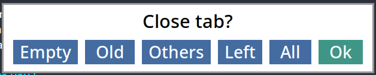
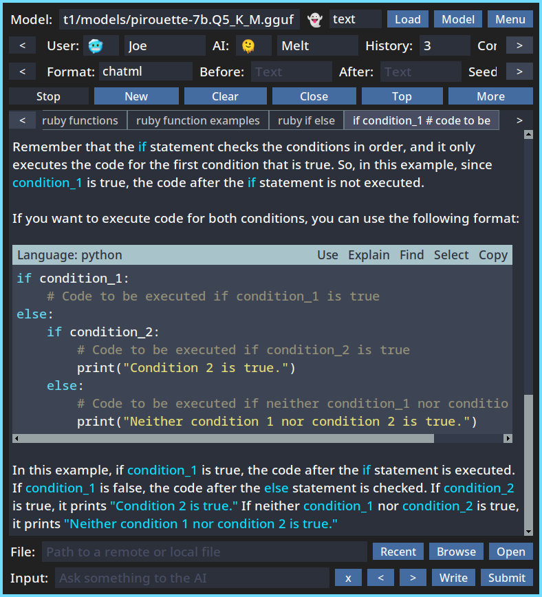
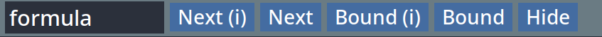

## An interface for llama.cpp, ChatGPT, Gemini, and Claude


---

This is a desktop application to interact with `large language models`.

It has hundreds of arguments and commands and many power user features.

It's written 100% in `python` and uses `tkinter` for the GUI.

---

## Index
1. [Screenshots](#screenshots)
1. [Installation](#installation)
1. [Models](#models)
1. [ChatGPT](#chatgpt)
1. [Gemini](#gemini)
1. [Claude](#claude)
1. [Paths](#paths)
1. [Profiles](#profiles)
1. [Input](#input)
1. [Commands](#commands)
1. [Tabs](#tabs)
1. [Markdown](#markdown)
1. [Snippets](#snippets)
1. [Find](#find)
1. [Images](#images)
1. [Console](#console)
1. [Listener](#listener)
1. [Logs](#logs)
1. [Upload](#upload)
1. [Signals](#signals)
1. [System](#system)
1. [Aliases](#aliases)
1. [Triggers](#triggers)
1. [Tasks](#tasks)
1. [Config](#config)
1. [Args](#args)
1. [Argfile](#argfile)
1. [Loading](#loading)
1. [Prompts](#custom)
1. [Palette](#palette)
1. [Taps](#taps)
1. [Gestures](#gestures)
1. [Variables](#variables)
1. [Files](#files)
1. [Images](#images)
1. [Themes](#themes)
1. [Compact](#compact)
1. [Autoscroll](#autoscroll)
1. [JoinLines](#join)
1. [Pins](#pins)
1. [Lockets](#lockets)
1. [Repeat](#repeat)
1. [Keywords](#keywords)
1. [Tips](#tips)

### Docs

1. [Commands](commands.md)
1. [Arguments](arguments.md)
1. [Keyboard](keyboard.md)

---

## Screenshots <a name="screenshots"></a>


---

## Installation <a name="installation"></a>

Note: By default `llama.cpp` (local model) support is not installed.

Read below to learn how to enable it.

Also, this has only been tested on `linux`.

---

### Using pipx

You can install it with [pipx](https://pypi.org/project/pipx/):

```sh
pipx install git+https://github.com/Merkoba/Meltdown
```

That will only enable remote features like `ChatGPT` and `Gemini`.

But that means the installation is easier and faster.

---

If you want to enable `llama.cpp` support for local models do this:

```sh
pipx install git+https://github.com/Merkoba/Meltdown#egg=meltdown[llama]
```

The difference is `#egg=meltdown[llama]` added at the end.

For `amd` you might need to install some `vulkan` system packages.

---

To install it with `Vulkan` support (GPU), you can do this:

```sh
CMAKE_ARGS="-DGGML_VULKAN=on" pipx install git+https://github.com/Merkoba/Meltdown#egg=meltdown[llama]
```

This is important because the GPU accelerates `tokens per second` a lot on local models.

`nvidia` GPUs haven't been tested yet.

---

Intalling with `pipx` provides the `meltdown` command.

And if on `linux`, you should now have a `.desktop` entry to launch it.

You can uninstall it with `pipx uninstall meltdown`.

---

### Manual Installation

To install manually, use a virtual env and `requirements.txt`.

You can use `scripts/venv.sh` to automate this.

---

To add local model support run `scripts/add_llama.sh`.

There's a `scripts/add_llama_amd.sh` to install with `Vulkan` support for `AMD`.

Pick one of those for local model support.

The `llama.cpp` library is defined in `llama_reqs.txt`.

These should be called after running `venv.sh` as they only add extra libraries.

---

To run the program, use `run.sh` in the root dir.

---

Read more about [`llama-cpp-python`](https://github.com/abetlen/llama-cpp-python).

This is the library used to interface with `llama.cpp`.

It is responsible for compiling `llama.cpp`.

---

## Models <a name="models"></a>

Local `gguf` models can be used.

Here's a good one you can use:

https://huggingface.co/QuantFactory/Meta-Llama-3-8B-Instruct-GGUF/blob/main/Meta-Llama-3-8B-Instruct.Q5_K_M.gguf

You can find more on that site.

The bigger the model, the longer it will take to load.

`llama.cpp` is the `inference engine` used, through `llama-cpp-python`.

Responses can be instant (when ready) or streamed as new bits arrive.

Streaming can be stopped. Models can be unloaded.

There is an argument to auto unload a model after x mintues.

For example: `--auto-unload 60` (1 hour).

---

## ChatGPT <a name="chatgpt"></a>

ChatGPT from OpenAI is supported.

You must first set the API key for it to work.

This can be done using the model menu.

Or using the `openaikey` command.

Then pick a model using the model menu or writing the name directly.

---

## Gemini <a name="gemini"></a>

Gemini from Google is supported.

You must first set the API key for it to work.

This can be done using the model menu.

Or using the `googlekey` command.

Then pick a model using the model menu or writing the name directly.

---

## Claude <a name="claude"></a>

Claude from Anthropic is supported.

You must first set the API key for it to work.

This can be done using the model menu.

Or using the `anthropickey` command.

Then pick a model using the model menu or writing the name directly.

---

## Paths <a name="files"></a>

Most files are saved in the system's data directory.

In linux this is `~/.local/share`.

The config files are saved in the system's config directory.

In linux this is `~/.config`.

The full paths take into account the name of the program and profile.

For example for a profile called `dev`:

Data: `~/.local/share/meltdown/dev`

Config: `~/.config/meltdown/dev`

In general things inside `config` should be "safe" to backup, with minimal personal information.

Data holds all conversations and widget history like input.
It also holds API keys.
So data should be treated as private.

It's possible to override these paths through arguments.

Using `--data-dir` and `--config-dir`.

---

## Profiles <a name="profiles"></a>

Different profiles can be created and used.

By default it uses the `main` profile.

Profiles have independent configs and data.

To launch with a different profile use the `--profile` argument.

For example: `--profile dev`.

To access the directories where profiles save files, use the `/profile` command.

---

## Input <a name="input"></a>

To enter messages for the AI, there is an input at the bottom.

Simply write something and press Enter.

Up/Down arrows can be used to go back to previous inputs used.

Right clicking the input shows recent inputs.

There is a `Write` button that opens a popup larger input to write more elaborate prompts.

The `Write` popup requires `ctrl + Enter` to submit, or use the button.

The input can also be used to run commands.

There is a `System Prompt` which you can modify using the `main menu`, or with `/system`.

The system prompt defines rules that will influence the responses you get.

---

## Commands <a name="commands"></a>

There are many commands to perform actions.

To use a command you can type them in the input.

For example: `/logtext`.

Some commands accept arguments.

For example: `/find fun`

Commands can be autocompleted with `tab`.

Multiple `tab` uses cycles between more matches.

Commands do a similarity check, so slightly malformed commands will match if similar enough.

---

## Tabs <a name="tabs"></a>

Each conversation is represented by a tab in a horizontal tab bar.

To open a new tab click the `New` button, or with `/new`,
or double clicking the empty tab bar, or with `ctrl + t`, or `ctrl + n`.

There are various ways to close tabs:



There is a maximum amount of tabs that can be opened at the same time (configurable).

After that limit is hit (100 by default), you will need to close old tabs to open new ones.
Its advised to not configure this limit to a very big number since problems can arise with many tabs.
The suggested workflow is to close all tabs after a while or closing `Old` tabs.

The mousewheel can be used to cycle between tabs and there are some shortcuts and commands for this.
There is also `shift + wheel` which you can use in the text output area to cycle tabs.
If `ctrl + wheel` is used in the tab bar, it will move/re-order the tabs left/right.
And `shift + wheel` can be used to scroll the tab bar without changing the tab.

There is a tab list which shows all the open tabs, which you can type to filter.
This is accessed by right clicking the conversation or with `/list`.

When tabs are created they get a short random word for its name.
After the first response from the AI, the name will be updated to a more relevant one.
The name can be renamed by right clicking the tab/conversation, or with `/rename`.

Tabs can be moved left/right by dragging them.
Multiple tabs can be selected by shift/ctrl clicking them. This allows you to move or close more tabs at the same time.

Tabs can be closed by middle clicking them. Empty tabs won't require a confirmation.
The need for confirmations can also be configured through arguments.

When there is a single tab, the tab bar is not shown, as soon as second tab is created, the tab bar is shown. This can be configured, to always show the tab bar, or to never show it.

There is a check that avoid creating new tabs when the last tabs is empty.
Instead it focuses the last empty tab. At the end or at the start.
To disable this you can use `--no-keep-empty-tab`.

---

## Markdown <a name="markdown"></a>

There is a markdown parser implemented from scratch, no library is used.

It can format the most common cases like bold, italic, quotes, backticks, headers, separators, snippets.

The text output is only parsed when needed, at the end of streams.
It is also able to only format the last line added to the textarea.
It aims to be as efficient as it can.

Each kind of markdown can be enabled or disabled for `user` or `ai`. For example bold can be enabled
for only the user, or the ai, or both, or none. This is done through arguments.

---

## Snippets <a name="snippets"></a>

Triple backticks produce snippets:



These get colored depending on the language used.

To achieve syntax highlighting, the `Pygments` library is used.

---

There are buttons on the top right to do several actions:

`Use` saves a sample of the snippet to the `$snippet` variable which can be used on the input.

`Explain` directly asks the AI to explain a sample.

`Find` finds text inside the snippet.

`Select` selects all the text in the snipper.

`Copy` copies all the text in the snippet.

---

## Find <a name="find"></a>

There is a find widget that allows searching for text inside conversations.

It can be activated with `ctrl + f` or `/find`, or `f3`.

It can also be accesed through the `More` menu.

It supports finding partial words, or whole words (bound).

It supports finding in text sensitive mode, or text insensitive mode.

It supports finding in reverse with `shift + enter`, or `shift + f3`, or middle clicking the buttons.

There is a command to find in all conversations: `/findall`.



---

## Images <a name="images"></a>

It's possible to generate images using `Dall-E`.

An `OpenAI` key is required for this.

To use it there is the `/image` command.

For example: `/image powerhouse of the cell`.

It will use the normal streaming mechanisms.

The response, if any, is the full `URL`.

Some parts of image generation can be customized through arguments.

---

## Console <a name="console"></a>

To enable the console use `--console`.

This allows you to send actions from the terminal that launched the program.

You can enter a simple text prompt, or send a command if the command prefix is used.

It uses `prompt_toolkit` and shows autocomplete suggestions with recently used words, or commands.

You could have the main program displayed on a monitor and control it with the terminal in another monitor for instance.

The console is not enabled by default because it can be problematic on certain environments depending on how the program was launched (i.e High CPU usage).
But it should work well on normal terminal launches.


---

## Listener <a name="listener"></a>

There's a listener mode that can be enabled with `--listen`.

When the listener is active, it will listen for file changes using `watchdog`.

If it finds text, it will use it as the prompt, or as a command if it starts with the command prefix.

It will then empty the file after using it.

You can do for instance `echo "hello" > /tmp/mlt_meltdown.input`.

Or: `echo "/new" > /tmp/mlt_meltdown.input`.

By default it checks `/tmp/mlt_meltdown.input` if on linux.

Temp Dir + `mlt_meltdown.input`.

But the file path can also be set with `--listen-file`.

This is another way to control the program remotely.

---

## Logs  <a name="logs"></a>

There is a logging system to save conversations to the file system.

It supports output in `text`, `json`, or `markdown`.

To log a conversation you can right click it and select `Save Log`.

Or use the commands: `/log`, `/logtext`, `/logjson`, `/logmarkdown`.

It's possible to also log all the open conversations (tabs).

By default the logs are saved in the `data` directory but it can be configured.

After saving a log, feedback is shown to easily open the file.

---

## Upload  <a name="upload"></a>

Conversations can be uploaded to a text hosting service.

For now it works with `rentry.org`.

The password (edit code) can be configured through `--upload-password`.

If no password is set, a random short word is used.

After the text is uploaded, a message appears that allows you to copy the URL.

The URL and password are also printed in the conversation window.

All the conversation can be uploaded, or just the last item.


---

## Signals <a name="signals"></a>

There is a signals system that allows to make requests to remote servers.

To use this, a json file must be created and pointed to with the `--signals` argument.

For example: `--signals ~/signals.json`.

---

Multiple signals can be defined. This is a demo with all the available keys:

```json
{
    "test": {
        "url": "https://test.com/submit",
        "method": "POST",
        "format": "text",
        "items": "all",
        "content": "status",
        "length": 500,
        "single": true,
        "data": {
            "username": "melt",
            "key": "someAuthKey"
        }
    }
}
```

---

`url` and `content` are always required, the rest are optional.

---

`url` is the url to use for the request. (required)

`method` can be `post`, `get`, or `put`. (default `post`)

`format` can be `text`, `json`, or `markdown`. (default `json`)

`items` can be `all`, to include the full conversation. Or `last`, to include only the last item. (default `all`)

`content` is the key used for the conversation text. (required)

`length` limits the content to that amount of characters. (default: 0)

`single` sends the content as a single line. (default: false)

`data` all the data keys needed to be sent. (default: empty)

For data, keywords are supported.

For example you can have `"date": "((now))"` (Unix timestamp)

Or: `"date": "((date))"` (Full date)

---

To run a signal you use the command with the name: `/signal test`.

Feedback is shown in the window if the signal failed or if it ran successfully.

---

## System <a name="system"></a>

At the top there are system monitors, like `CPU`, `RAM`, `Temperature`, and `GPU` related ones.

`GPU` might not work for all users. It has only been tested for `AMD` in certain systems.

The monitors turn off a short time after the last response (1 minute).

For example `--system-suspend 5` turns off the monitors after 5 minutes since last use.

And `--system-suspend 0` will keep the system monitors running all the time.

They turn red when they reached a threshold, which can be configured.

By default, the system frame will only be shown if a local model is loaded.

To disable this behavior you can use `--no-system-auto-hide`.


---

## Aliases <a name="aliases"></a>

Command aliases can be set. And they can be chained.

For example: `--alias test="/top & /sleep 0.5 & /about"`.

Then when using the `/test` command, it will perform those 3 commands.

In that example there's a delay of 500ms between `/top` and `/about`.

This can be useful to quickly change between model configurations.

For example: `--alias mini="/config model gpt-4o-mini & /config temperature 0.1"`.

---

## Triggers <a name="triggers"></a>

It's possible to change the input text from a word or phrase to a full longer value.

The text is converted upon submit.

You can register triggers like this:

`--trigger "the thing = Come up with a new theory about The Thing"`

And if you submit exactly "the thing", it will be converted to the full text.

The `=` is needed here because triggers can contain spaces.

A possible trigger you might want could be:

`--trigger "... = Please continue talking"`

This can be a powerful way to interact with the AI.

---

## Tasks <a name="tasks"></a>

Tasks that run periodically can be registered.

Format is `[seconds] [commands] [/now (optional)]`

For example `--task "60 /signal update"`

This will run the `update` signal every 60 seconds.

If you add `/now` it will run the first one when the program starts.

For example `--task "60 /signal update /now"`

Units can be used, this includes `s`, `m`, `h`, and `d`.

Which mean seconds, minutes, hours, and days.

For example `--task "2h /prompt tell me something about ((noun))"`.

This will run that task every 2 hours.

---

## Changing Config <a name="set"></a>

The `config` command allows to change the configuration of the program.

This means any widget can be set.

For example `/config model gemini-1.5`.

Or `/config name_user Bob`.

To know the name of the widget, hover over it.

## Changing Arguments <a name="args"></a>

Arguments are usually set when launching the program, but they can also be changed while it's running.

This can be done with the `arg` command.

For example: `/arg taps false`. (boolean)

Or `/arg delay 0.2`. (ints or floats)

Or `/arg f1 /close`. (strings)

Or `/arg custom_prompts [one = prompt one, two = prompt two]` (lists of strings)

The `=` format is required because the name of custom prompts can have multiple words.

While this is possible, some argument changes won't work, and some might cause problems.

---

## Argfile <a name="argfile"></a>

It's possible to point to a json file that overrides arguments.

For example: `--argfile ~/args.json`.

This is a way to launch with different configurations easily.

For example:

```json
{
    "auto_unload": 60,
    "aliases": [
        "gpt /loadconfig gpt",
        "gem /loadconfig gem",
        "pro /loadconfig pro",
        "llama /loadconfig llama",
        "think /promptforce Tell something interesting you thought about ((noun))...",
        "listen /notify Listen to this",
        "talk /listen & /think"
    ],
    "custom_prompts": [
        "In Spanish = Explain ((words)) spanish",
        "In Japanse = Explain ((words)) japanese"
    ],
    "tasks": [
        "2h /talk"
    ],
    "variables": [
        "meta /media/struct1/models/Meta-Llama-3.1-8B-Instruct-Q5_K_M.gguf"
    ]
}
```

---

## Loading <a name="loading"></a>

It's possible to save the current config and session.

This can be done through the `main menu` or through commands.

For example: `/saveconfig`, or `/saveconfig books`.

Or: `/savesession`, or `/savesession books`.

Loading: `/loadconfig books`, `/loadsession books`.

If arguments are not used, a file picker appears.

Config meaning the current configuration of all the widgets.

Session meaning the set of conversations (tabs and their content).

---

## Custom Prompts <a name="custom"></a>

When highlighted words are clicked, a menu with several options appear.

Custom Prompts can be registered to explain these words in a special way.

For this the keywords are needed, like `((words))`

For example: `--custom-prompt Spanish="shortly explain ((words)) in spanish"`


---

## Palette <a name="palette"></a>

Apart from typing the commands in the input (which supports autocompletion with tab),
there is another way to run commands through a palette.

To spawn it, tap `ctrl` twice in a row, or in the `main menu`, or with `/palette`.

You can filter it by typing some letters.


---

## Double Taps <a name="taps"></a>

When `ctrl` is pressed twice in a row quickly, a command gets executed.

By default it opens the `Command Palette` but it can be configured.

---

## Gestures <a name="gestures"></a>

There are 4 mouse gestures that can be mapped to commands.

These are `up`, `down`, `left`, and `right`.

To trigger these, hold the right mouse button, move to a direction, and release the button.

By default these scroll up/down and move to tabs left/right.

---

## Variables <a name="variables"></a>

Variables can be set, unset, and read.

These are used in the inputs.

For example you can do: `/set name George`.

Then you can write: `who is $name?`.

The input is converted to its full form before being used.

So that would be converted to `who is George?`.

You can unset with `/unset name`.

Read with `/var name`.

Variables can be filled at startup using arguments.

For example: `--var "name George" --var "num 1200"`.

The prefix like `$` can be changed.

For example: `--variable-prefix @`

So you can do: `who is @name?`.

Variables also work in the `model` field.

---

## Files <a name="files"></a>

There is a files panel where you can enter file paths.

For now it can do simple text file analysis.

And it can also be used for image files when using special models.

When the file is used it is removed from the input, and not used for the next prompts.

The used file paths are remembered in the session file, but not their content.

---

## Images <a name="images"></a>

Multi-modal models like llava 1.5 can be used.

Download the model gguf and the mmproj gguf (clip model):

https://huggingface.co/mys/ggml_llava-v1.5-7b/tree/main

Put those 2 files in the same directory.

Rename the clip model file to `mmproj.gguf`.

Set `Mode` to `images`.

Now you can use the `File` field to include a URL or path to an image.

And you can use the input to include text as normal.

While this has been tested to work, it's still considered experimental.

---

## Themes <a name="themes"></a>

There are 3 available color themes. `dark`, `light`, and `high contrast`.

### Dark


---

### Light


---

## High Contrast


---

You can access `Theme` in the `main menu`.

Or by using the `/theme` command.

The application needs to restart for the theme to take effect.

---

It's also possible to change the border color and size.

Using: `--border-size` and `--border-color`.

There is a border effect that can be enabled with `--border-effect`.

The color can be changed with `--border-effect-color`.

This changes the color of the border when a response starts to stream.

Then restores the normal color when the stream is done.

---

## Compact <a name="compact"></a>

There is a compact mode which hides some widgets from the window.

This can be useful if you want a less distracted interface.

To toggle compact mode you can use the `main menu`, or `f8`, or `/compact`, or `--compact`.

There are arguments you can use to define which panels get removed in compact mode.

---

## Autoscroll <a name="autoscroll"></a>

The output window can be auto scrolled.

That means it will scroll slowly downwards or upwards.

So you can read text without manual intervention.

To activate this you can click `Autoscroll` in the `Go To Bottom` panel.

Or use the `/autoscroll` command. This command accepts optional `up`, and `down` arguments.

To scroll upwards you can also middle click the `Top` button.

There is also `f9` and `shift + f9` shortcuts.

The scroll delay can be configured through arguments.

When the autoscroll mode is active, the button has a different color.

When the scroll ends the autoscroll mode gets disabled.

The mode also gets disabled when manually scrolled.

You can use `--no-autoscroll-interrupt` to avoid stopping it when scrolling up/down.

There are buttons on each side to make scrolling slower or faster.

---

## Join Lines <a name="join"></a>

Multiple lines can be joined with a character, in case you want a more concise presentation.

For example:

```
Sentence One
Sentence Two
Sentence Three
```

That would be converted to `Sentence One 👾 Sentence Two 👾 Sentence Three`.

To enable this you can use `--join-lines-user` and `--join-lines-ai`.

To change the char, you can use `--join-lines-char 😀`

It ignores triple backtick snippets, it tries to keep those lines intact.

---

There's also `--clean-lines-ai`, to collapse multiple empty lines into a single line.

---

## Pins <a name="pins"></a>

Conversations/tabs can be pinned.

This can be done using the tab's context menu.

Or using `/pin`, `/unpin`, `/togglepin`.

This allows finding them easily through the special pin list.

And allows closing either just normal tabs or just pins.

---

## Lockets <a name="lockets"></a>

Sometimes you might need to access some data but don't feel comfortable having it printed anywhere or even visible for a couple of seconds. This can be for several reasons revolving around privacy and personal security.

You might want to have a way to have the computer/AI have a peek at this data and respond with the neccessary safe information you request.

Lockets are registered at startup through arguments.

For example `--locket name some command`.

Multiple lockets can be registered.

Then the `/locket` command can be used like:

`/locket date what is the week day?`

`/locket joe what ice cream does he like?`

These can be using commands that fetch date or profile information.

---

## Repeat <a name="repeat"></a>

On the item right click menu there are some `Repeat` options.

This is a way to re-run the prompt, with or without history.

This is a smart command that cuts off history up to that point when making the prompt.

This can be a way to check how different models might have answered to the same input.

---

## Keywords <a name="keywords"></a>

There are some keywords that you can use in commands, the input, or system prompt.

---

### ((name_user))

Name of the user.

---

### ((name_ai))

Name of the AI.

---

### ((date))

Current date.

---

### ((now))

Current unix time in seconds.

---

### ((name))

Name of the current tab.

---

### ((noun))

Random noun.

---

### %@sometext%@

This is a special syntax to create `uselinks`.

These are used to prompt directly on click.

---

## Tips <a name="tips"></a>

Right clicking inputs like `model` and `input` show recently used items.

Middle clicking items in these lists delete them from the list.

There are 3 scrollable panels at the top, which can be scrolled by clicking the arrows on the sides
or by using the mousewheel.

Middle clicking the panel arrows scrolls instantly to that side.

There are `/like` and `/dislike` commands.