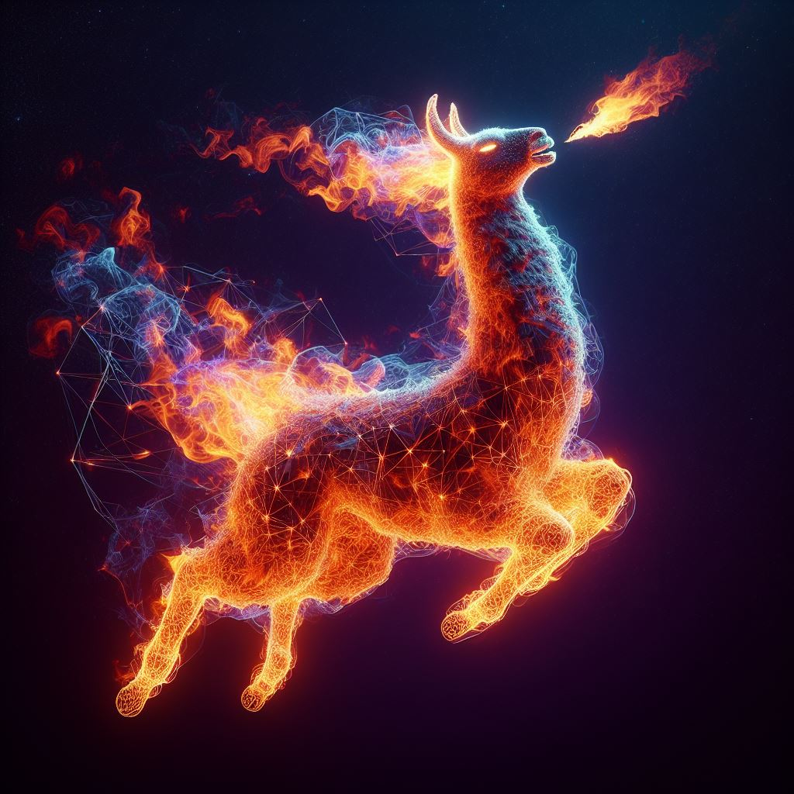

## An interface for llama.cpp, ChatGPT, and Gemini



---

## Index
1. [Screenshots](#screenshots)
1. [Models](#models)
1. [ChatGPT](#chatgpt)
1. [Gemini](#gemini)
1. [Installation](#installation)
1. [Commands](commands.md)
1. [Arguments](arguments.md)
1. [Keyboard](keyboard.md)

---

## Screenshots <a name="screenshots"></a>


---


## Installation <a name="installation"></a>

You can install it with [pipx](https://pypi.org/project/pipx/):

```sh
pipx install git+https://github.com/Merkoba/Meltdown --force
```

Which provides the `meltdown` command.

---

To install it with `Vulkan` support (GPU), you can do this:

```sh
CMAKE_ARGS="-DGGML_VULKAN=on" pipx install git+https://github.com/Merkoba/Meltdown --force
```

---

To install manually, use a virtual env and `requirements.txt`.

You can use `scripts/venv.sh` to automate this.

Alternatively, there's a `scripts/venv_amd.sh` to install with `Vulkan` support for `AMD`.

To run the program, use `run.sh` in the root dir.

---

More information [here](https://github.com/abetlen/llama-cpp-python).

---

## Models <a name="models"></a>

You will need some models to play with.

Here's a good one you can use:

https://huggingface.co/QuantFactory/Meta-Llama-3-8B-Instruct-GGUF/blob/main/Meta-Llama-3-8B-Instruct.Q5_K_M.gguf

You can find more on that site.

---

## ChatGPT <a name="chatgpt"></a>

ChatGPT is also supported.

You must first set the API key for it to work.

This can be done using the model menu: `Set OpenAI Key`.

Or using the `openaikey` command.

Then pick the model you want: `Use GPT Model`.

---

## Gemini <a name="gemini"></a>

Gemini is also supported.

You must first set the API key for it to work.

This can be done using the model menu: `Set Google Key`.

Or using the `googlekey` command.

Then pick the model you want: `Use Gemini Model`.

---

## Images <a name="images"></a>

Multi-modal models like llava 1.5 can be used.

Download the model gguf and the mmproj gguf (clip model):

https://huggingface.co/mys/ggml_llava-v1.5-7b/tree/main

Put those 2 files in the same directory.

Rename the clip model file to `mmproj.gguf`.

Set `Mode` to `images`.

Now you can use the `File` field to include a URL or path to an image.

And you can use the input to include text as normal.

---

## Drag and Drop

Some widgets like File and Input accept drag and drop operations.

For instance you can drop a file to use its path.

Or text to use as input.

However, you need to have `tkdnd` installed in your system.

This is an extension for `Tcl`.

If you want to enable, it use the `--drag-and-drop` flag.

---

## Console

To enable the console use `--show-console`.

This allows you to send actions from the terminal that launched the program.

---

## Keywords

There are some keywords you can use in commands:

---

### ((name_user))

Name of the user.

---

### ((name_ai))

Name of the AI.

---

### ((date))

Current date.

---

### ((now))

Current unix time in seconds.

---

### ((name))

Name of the current tab.

---

### ((noun))

Random noun.

---

### %@sometext%@

This is a special syntax to create `uselinks`.

These are used to prompt directly on click.