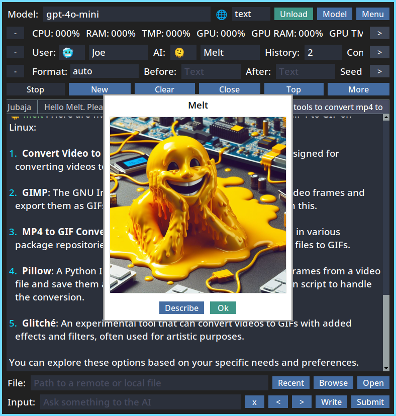
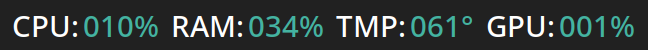

## An interface for llama.cpp, ChatGPT, and Gemini


---

## Index
1. [Screenshots](#screenshots)
1. [Installation](#installation)
1. [Models](#models)
1. [ChatGPT](#chatgpt)
1. [Gemini](#gemini)
1. [Console](#console)
1. [Listener](#listener)
1. [Upload](#upload)
1. [Signals](#signals)
1. [System](#system)
1. [Aliases](#aliases)
1. [Tasks](#tasks)
1. [Config](#config)
1. [Args](#args)
1. [Prompts](#custom)
1. [Palette](#palette)
1. [Gestures](#gestures)
1. [Images](#images)
1. [Themes](#themes)
1. [Keywords](#keywords)
1. [Tips](#tips)

### Docs

1. [Commands](commands.md)
1. [Arguments](arguments.md)
1. [Keyboard](keyboard.md)

---

## Screenshots <a name="screenshots"></a>




---


## Installation <a name="installation"></a>

Note: By default `llama.cpp` (local model) support is not installed.

Read below to learn how to enable it.

Also, this has only been tested on `Linux`.

---

### Using pipx

You can install it with [pipx](https://pypi.org/project/pipx/):

```sh
pipx install git+https://github.com/Merkoba/Meltdown
```

That will only enable remote features like `ChatGPT` and `Gemini`.

But that means the installation is easier and faster.

---

If you want to enable `llama.cpp` support for local models do this:

```sh
pipx install git+https://github.com/Merkoba/Meltdown#egg=meltdown[llama]
```

The difference is `#egg=meltdown[llama]` added at the end.

---

To install it with `Vulkan` support (GPU), you can do this:

```sh
CMAKE_ARGS="-DGGML_VULKAN=on" pipx install git+https://github.com/Merkoba/Meltdown#egg=meltdown[llama]
```

---

Intalling with `pipx` provides the `meltdown` command.

And if on `Linux`, you should now have a `.desktop` entry to launch it.

You can uninstall it with `pipx uninstall meltdown`.

---

### Manual Installation

To install manually, use a virtual env and `requirements.txt`.

You can use `scripts/venv.sh` to automate this.

---

To add local model support run `scripts/venv_llama.sh`.

There's a `scripts/venv_llama_amd.sh` to install with `Vulkan` support for `AMD`.

Pick one of those for local model support.

The `llama.cpp` library is defined in `llama_reqs.txt`.

These should be called after running `venv.sh` as they only add extra libraries.

---

To run the program, use `run.sh` in the root dir.

---

Read more about [`llama-cpp-python`](https://github.com/abetlen/llama-cpp-python).

This is the library used to interface with `llama.cpp`.

It is responsible for compiling `llama.cpp`.

---

## Models <a name="models"></a>

Local `gguf` models can be used.

Here's a good one you can use:

https://huggingface.co/QuantFactory/Meta-Llama-3-8B-Instruct-GGUF/blob/main/Meta-Llama-3-8B-Instruct.Q5_K_M.gguf

You can find more on that site.

The bigger the model, the longer it will take to load.

---

## ChatGPT <a name="chatgpt"></a>

ChatGPT is also supported.

You must first set the API key for it to work.

This can be done using the model menu: `Set OpenAI Key`.

Or using the `openaikey` command.

Then pick the model you want: `Use GPT Model`.

---

## Gemini <a name="gemini"></a>

Gemini is also supported.

You must first set the API key for it to work.

This can be done using the model menu: `Set Google Key`.

Or using the `googlekey` command.

Then pick the model you want: `Use Gemini Model`.

---

## Console <a name="console"></a>

To enable the console use `--console`.

This allows you to send actions from the terminal that launched the program.

You can enter a simple text prompt, or send a command if the command prefix is used.

It uses `prompt_toolkit` and it shows autocomplete suggestions with recently used words, or commands.

You could have the main program displayed on a monitor and control it with the terminal in another monitor for instance.

The console is not enabled by default because it can be problematic on certain environments depending on how the program was launched (i.e High CPU usage).
But it should work well on normal terminal launches.


---

## Listener <a name="listener"></a>

There's a listener mode that can be enabled with `--listener`.

When the listener is active, it will periodically read a file and check for changes.

If it finds text, it will use it as the prompt, or as a command if it starts with the command prefix.

It will then empty the file after using it.

You can do for instance `echo "hello" > /tmp/mlt_meltdown.input`.

Or: `echo "/new" > /tmp/mlt_meltdown.input`.

By default it checks `/tmp/mlt_meltdown.input` if on Linux.

Temp Dir + `mlt_meltdown.input`.

But the file path can also be set with `--listener-path`.

This is another way to control the program remotely.


---

## Upload  <a name="upload"></a>

Conversations can be uploaded to a text hosting service.

For now it works with `rentry.org`.

The password (edit code) can be configured through `--upload-password`.

If no password is set, a random short word is used.

After the text is uploaded, a message appears that allows you to copy the URL.

The URL and password are also printed in the conversation window.

All the conversation can be uploaded, or just the last item.


---

## Signals <a name="signals"></a>

There is a signals system that allows to make requests to remote servers.

To use this, a json file must be created and pointed to with the `---signals-file` argument.

---

Multiple signals can be defined. This is a demo with all the available keys:

```json
{
    "test": {
        "url": "https://test.com/submit",
        "method": "POST",
        "format": "text",
        "items": "all",
        "content_key": "status",
        "content_length": 500,
        "single_line": true,
        "data": {
            "username": "melt",
            "key": "someAuthKey"
        }
    }
}
```

---

`url` and `content_key` are always required, the rest are optional.

---

`url` is the url to use for the request. (required)

`method` can be `post`, `get`, or `put`. (default `post`)

`format` can be `text`, `json`, or `markdown`. (default `json`)

`items` can be `all`, to include the full conversation. Or `last`, to include only the last item. (default `all`)

`content_key` is used for the conversation text. (required)

`content_length` limits the content to that amount of characters. (default: 0)

`single_line` sends the content as a single line. (default: false)

`data` all the data keys needed to be sent. (default: empty)

---

To run a signal you use the command with the name: `/signal test`.

Feedback is shown in the window if the signal failed or if it ran successfully.

---

## System <a name="system"></a>

At the top there are system monitors, like `CPU`, `RAM`, `Temperature`, and `GPU` related ones.

`GPU` might not work for all users. It has only been tested for `AMD` in certain systems.

By default they turn off after a short time after the last response.

They turn red when they reached a threshold, which can be configured.



---

## Aliases <a name="aliases"></a>

Command aliases can be set. And they can be chained.

For example: `--alias test="/top & /sleep 0.5 & /about"`.

Then when using the `/test` command, it will perform those 3 commands.

In that example there's a delay of 500ms between `/top` and `/about`.

This can be useful to quickly change between model configurations.

For example: `--alias mini="/config model gpt-4o-mini & /config temperature 0.1"`.

---

## Tasks <a name="tasks"></a>

Tasks that run periodically can be registered.

Format is `[seconds] [commands] [/now (optional)]`

For example `--task "60 /signal update"`

This will run the `update` signal every 60 seconds.

If you add `/now` it will run the first one when the program starts.

For example `--task "60 /signal update /now"`

---

## Config <a name="set"></a>

The `config` command allows to change the configuration of the program.

This means any widget can be set.

For example `/config model gemini-1.5`.

Or `/config name_user Bob`.

To know the name of the widget, hover over it.

## Args <a name="args"></a>

Arguments are usually set when launching the program, but they can also be changed while it's running.

This can be done with the `arg` command.

For example: `/arg taps false`. (boolean)

Or `/arg delay 0.2`. (ints or floats)

Or `/arg f1 /close`. (strings)

Or `/arg custom_prompts [one = prompt one, two = prompt two]` (lists of strings)

While this is possible, some argument changes won't work, and some might cause problems.

---

## Custom Prompts <a name="custom"></a>

When highlighted words are clicked, a menu with several options appear.

Custom Prompts can be registered to explain these words in a special way.

For this the keywords are needed, like `((words))`

For example: `--custom-prompt Spanish="shortly explain ((words)) in spanish"`


---

## Palette <a name="palette"></a>

Apart from typing the commands in the input (which supports autocompletion with tab),
there is another way to run commands through a palette.

To spawn it, tap `ctrl` twice in a row (or through the `/palette` command).

You can filter it by typing some letters.


---

## Gestures <a name="gestures"></a>

There are 4 mouse gestures that can be mapped to commands.

These are `up`, `down`, `left`, and `right`.

To trigger these, hold the right mouse button, move to a direction, and release the button.

By default these scroll up/down and move to tabs left/right.

---

## Images <a name="images"></a>

Multi-modal models like llava 1.5 can be used.

Download the model gguf and the mmproj gguf (clip model):

https://huggingface.co/mys/ggml_llava-v1.5-7b/tree/main

Put those 2 files in the same directory.

Rename the clip model file to `mmproj.gguf`.

Set `Mode` to `images`.

Now you can use the `File` field to include a URL or path to an image.

And you can use the input to include text as normal.

While this has been tested to work, it's still considered experimental.

---

## Themes <a name="themes"></a>

There are 3 available color themes. `dark`, `light`, and `high contrast`.


### Dark


---

### Light


---

## High Contrast


---

You can access `Theme` in the `main menu`.

Or by using the `/theme` command.

The application needs to restart for the theme to take effect.

---

## Keywords <a name="keywords"></a>

There are some keywords you can use in commands:

---

### ((name_user))

Name of the user.

---

### ((name_ai))

Name of the AI.

---

### ((date))

Current date.

---

### ((now))

Current unix time in seconds.

---

### ((name))

Name of the current tab.

---

### ((noun))

Random noun.

---

### %@sometext%@

This is a special syntax to create `uselinks`.

These are used to prompt directly on click.

---

## Tips <a name="tips"></a>

Right clicking inputs like `model` and `input` show recently used items.

Middle clicking items in these lists delete them from the list.

There are 3 scrollable panels at the top, which can be scrolled by clicking the arrows on the sides
or by using the mousewheel.

Middle clicking the panel arrows scrolls instantly to that side.